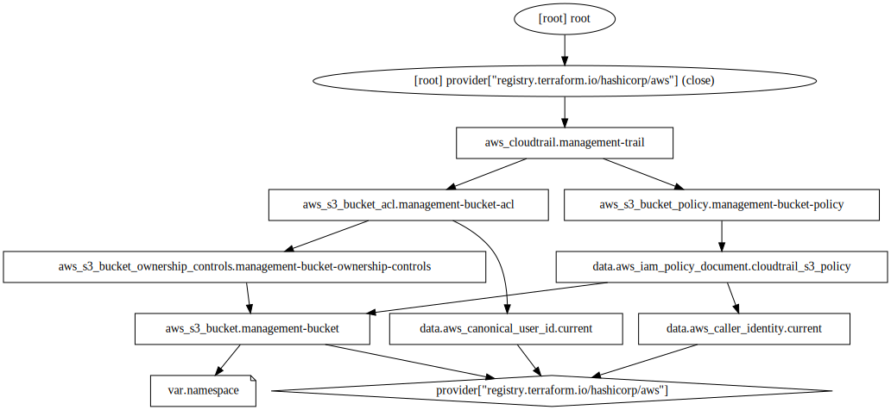

# Cloudtrail Trail

This module creates a standard management events cloudtrail trail, and the necessary permissions to enable it.

https://docs.aws.amazon.com/awscloudtrail/latest/userguide/logging-management-events-with-cloudtrail.html

## Resource Graph

<!-- BEGIN_TF_DOCS -->
## Requirements

No requirements.

## Providers

| Name | Version |
|------|---------|
|  [aws](#provider\_aws) | 4.27.0 |

## Modules

No modules.

## Resources

| Name | Type |
|------|------|
| [aws_cloudtrail.management-trail](https://registry.terraform.io/providers/hashicorp/aws/latest/docs/resources/cloudtrail) | resource |
| [aws_s3_bucket.management-bucket](https://registry.terraform.io/providers/hashicorp/aws/latest/docs/resources/s3_bucket) | resource |
| [aws_s3_bucket.management-bucket-ownership-controls](https://registry.terraform.io/providers/hashicorp/aws/latest/docs/resources/s3_bucket_ownership_controls) | resource |
| [aws_s3_bucket_acl.management-bucket-acl](https://registry.terraform.io/providers/hashicorp/aws/latest/docs/resources/s3_bucket_acl) | resource |
| [aws_s3_bucket_policy.management-bucket-policy](https://registry.terraform.io/providers/hashicorp/aws/latest/docs/resources/s3_bucket_policy) | resource |
| [aws_caller_identity.current](https://registry.terraform.io/providers/hashicorp/aws/latest/docs/data-sources/caller_identity) | data source |
| [aws_canonical_user_id.current](https://registry.terraform.io/providers/hashicorp/aws/latest/docs/data-sources/canonical_user_id) | data source |
| [aws_iam_policy_document.cloudtrail_s3_policy](https://registry.terraform.io/providers/hashicorp/aws/latest/docs/data-sources/iam_policy_document) | data source |

## Inputs

| Name | Description | Type | Default | Required |
|------|-------------|------|---------|:--------:|
|  [namespace](#input\_namespace) | Define the namespace here, example: foobarinc-dev (projectname-environment) | `string` | n/a | yes |

## Outputs

No outputs.
<!-- END_TF_DOCS -->
